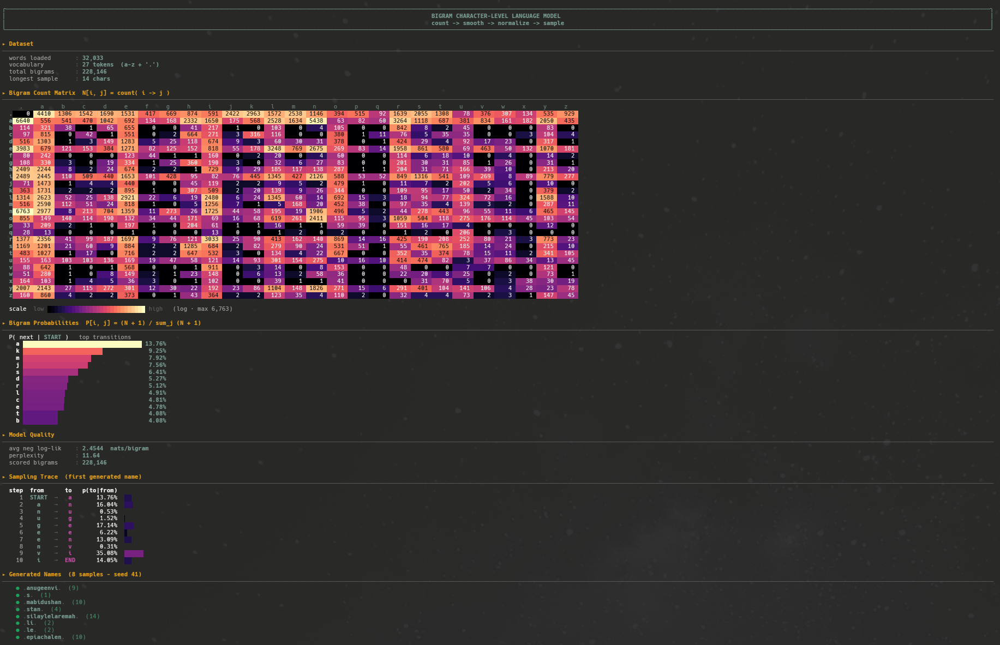
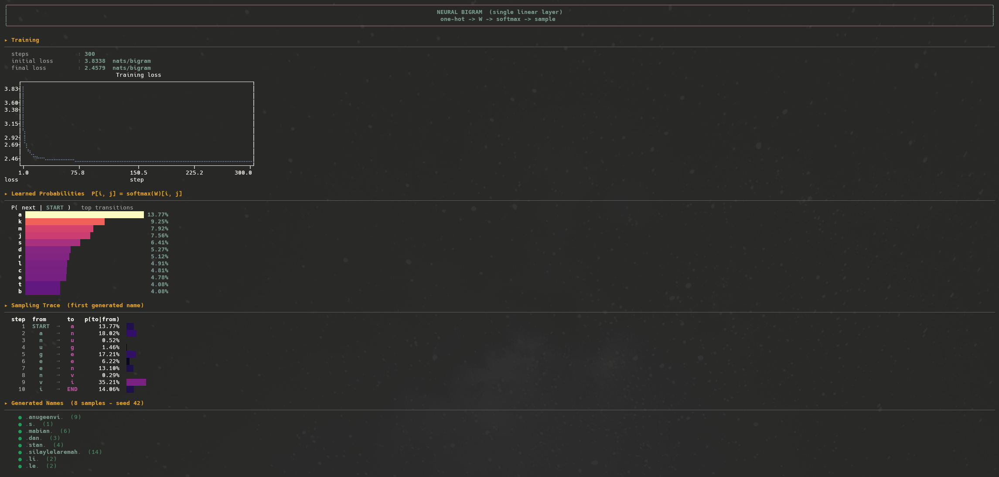

# 01 | Bigram

A character-level language model, which I build two ways that give exactly the
same result:

1. **By counting**: count letter pairs and normalize.
2. **As a neural network**: a single linear layer trained by gradient descent
   recovers the same probabilities.

I'm not after pretty names here, I want to see for myself that "counting
bigrams" and "training a network" are two views of the same object.

## The problem

We start from a list of ~32,000 names (`data/names.txt`). A bigram model predicts
the next letter from the current letter alone. We add a special `.` token to mark
the start and end of a word:

```
emma  ->  .e  em  mm  ma  a.
```

The vocabulary is therefore 27 symbols: `a`–`z` plus the `.`.

## 1. Counting model

```
count  ->  smooth  ->  normalize  ->  sample
```

- We fill a matrix `N` of shape `(27, 27)` where `N[i, j]` = how many times
  letter `i` is followed by letter `j`.
- We smooth with `+1` (*Laplace smoothing*) so no probability is zero, then
  normalize each row to get `P`, a row-stochastic transition matrix (each row
  sums to 1).
- We sample letter by letter, starting from `.` until we land back on `.`.



It shows the count matrix, the probabilities, the model quality, and a few
generated names.

**Quality.** We measure the average *negative log-likelihood* (NLL) over the whole
dataset, and the associated perplexity (`exp(NLL)`). The lower it is, the better
the model "explains" the data.

## 2. Equivalent neural model

```
one-hot  ->  W  ->  softmax  ->  sample
```

The same computation, but learned instead of counted:

- Each input letter is **one-hot** encoded (a vector of size 27).
- A weight matrix `W` of shape `(27, 27)` produces *logits*.
- A **softmax** over each row turns the logits into probabilities.
- We train `W` by gradient descent (300 steps), minimizing the NLL.

At convergence, `softmax(W)` reproduces the matrix `P` of the counting model:
both approaches describe the same distribution. The `+1` smoothing corresponds
here to a light regularization (the weights stay finite).



It shows the loss curve going down, the learned probabilities, a sampling trace,
and the generated names.

## Running the experiment

From the repo root:

```bash
python3 src/01-bigram/main.py
```

Both models run one after the other and print their results in the terminal
(matrices, distributions, curves, and sampled names).

## Takeaways

- An *n*-gram can be written either as a count or as a neural network, and both
  converge to the same thing.
- The role of **softmax** in turning free-form scores into a distribution.
- The **NLL** works as both a loss function and a quality measure.
- Count-based smoothing ≈ regularization on the network side.
- The limit of the bigram: it only looks one letter back, hence the unrealistic
  names. That's exactly what I lift in `02-mlp` by widening the context.
