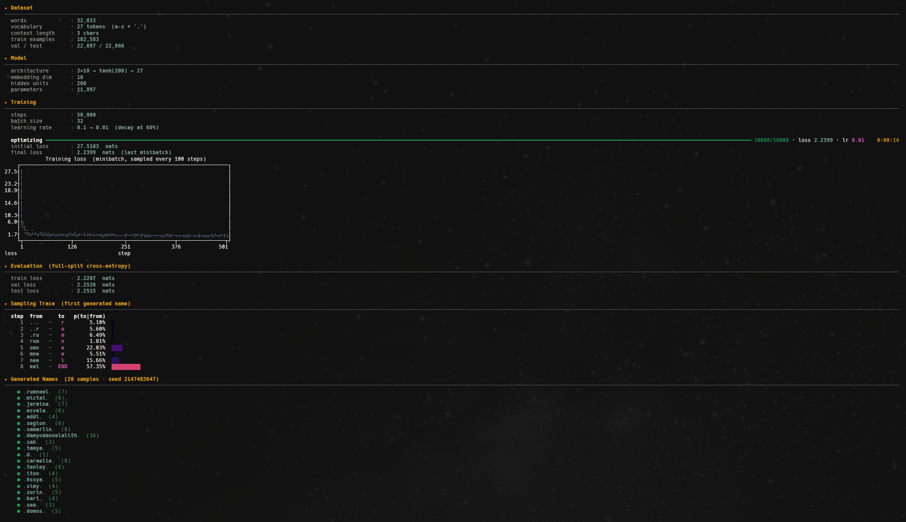
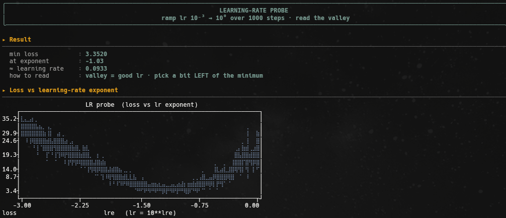

# 02 | MLP

A character-level language model with a **multi-layer perceptron**, following
Bengio et al. (2003). Where the bigram only looked one letter back, here I feed
the model a window of several letters and let it learn its own features, through
**embeddings** and a hidden layer, instead of reading them off a count matrix.

I'm lifting the bigram's hard limit (one letter of context) and, along the way,
building the blocks every later experiment reuses: embeddings, a hidden layer,
minibatch training, a learning-rate schedule, and an honest train/dev/test
split.

## The problem

Same ~32,000 names (`data/names.txt`), same 27-symbol vocabulary (`a`–`z` plus
the boundary token `.`). But now each prediction sees the **last 3 characters**
of context instead of one:

```
.emma  ->  ...->e   ..e->m   .em->m   emm->a   mma->.
```

A bigram has to summarize everything it knows in a `27×27` table. Widen the
context to 3 characters and a count table would need `27³` rows, most of them
never seen. The MLP sidesteps this: it learns a dense representation of context
rather than memorizing every combination.

## The model

```
context (3 chars)  ->  embed  ->  concat  ->  tanh hidden  ->  logits  ->  softmax
```

- **Embedding.** Each character is mapped to a learned vector of size `10`
  (matrix `C`, shape `27×10`). Similar letters can end up with similar vectors -
  something a one-hot bigram can't express.
- **Concatenate.** The 3 context embeddings are flattened into one `30`-d input.
- **Hidden layer.** A linear layer `W1, b1` followed by `tanh` gives `200`
  hidden features.
- **Output.** A second linear layer `W2, b2` produces 27 *logits*, turned into a
  probability distribution by **softmax**.

That's **11,897 parameters** in total, trained end to end by gradient descent.



The script prints the whole run: dataset and model summary, a live training
progress bar, the loss curve, the held-out evaluation, a sampling trace, and the
generated names.

## Training

```
sample a minibatch  ->  forward  ->  cross-entropy  ->  backward  ->  SGD step
```

- We shuffle the names and split **80 / 10 / 10** into train / dev / test
  (182k / 23k / 23k examples). The dev and test sets are never trained on, so
  their loss is an honest measure of generalization.
- Each step trains on a random **minibatch of 32** examples, fast, noisy
  gradients that are good enough to make progress.
- The loss is the **cross-entropy** between the predicted distribution and the
  true next character (the same negative log-likelihood as the bigram).
- The **learning rate** uses `0.07` (read off the probe's valley, see below) for
  the first 60% of the 50,000 steps, then decays tenfold to `0.007` to settle
  into a finer minimum at the end.

## Finding the learning rate (the probe)

Where does `0.07` come from? Not from copying a value, from measuring it. The
learning rate is the most sensitive knob in gradient descent: too small and the
loss barely moves, too large and it diverges. The **probe** finds the right
order of magnitude empirically, in one short throwaway run.

```
ramp lr 10⁻³ -> 10⁰ over 1000 steps  ->  record (lr, loss)  ->  plot  ->  read the valley
```

- We train a **throwaway** model for 1000 steps, raising the learning rate a
  little at every step, from `0.001` to `1`. Its weights are discarded
  afterwards, only the curve matters.
- We sweep the **exponent** linearly (`lr = 10**lre`, `lre` from -3 to 0), because
  what matters is the order of magnitude, not a linear range of raw values.
- We record the loss at each step and plot it against the exponent.



Reading the curve: on the left the loss barely moves (lr too small), then it
drops into a **valley**, then it shoots back up (lr too large). The bottom of the
valley sits around exponent `-1` (`10⁻¹ ≈ 0.1`); we take a slightly safer value a
touch to the left, `≈ 0.07` (exponent `-1.15`), as the **base** learning rate,
then decay it tenfold to `0.007` for the final 40% of training. The rate is
*derived*, not guessed.

Run the sweep on its own with:

```bash
python3 src/02-mlp/main.py --probe
```

## Results

| split | cross-entropy (nats) |
| --- | --- |
| train | ≈ 2.22 |
| dev   | ≈ 2.25 |
| test  | ≈ 2.25 |

Dev and test track train closely, so the model **generalizes** rather than
memorizes. The loss is clearly below the bigram's, and the samples read more like
plausible names:

```
rumneel - mictai - jermina - esvala - addi - samarlin - tamya - caraelie - tenley
```

Still imperfect, 3 characters of context is short, but a real step up from the
one-letter bigram.

## Tuning the model

`N_EMBD` (embedding size) and `N_HIDDEN` (hidden units) are the two knobs you turn
directly in the script. A few runs on the held-out splits (same `--probe` learning
rate, 50k steps) show what each one actually buys:

| n_embd | n_hidden | train | val | test |
| --- | --- | --- | --- | --- |
| 3  | 300 | 2.27 | 2.29 | 2.28 |
| 10 | 200 | 2.24 | 2.26 | 2.26 |
| 20 | 200 | 2.19 | 2.26 | 2.26 |

(The minibatch "final loss" printed at the end of a run is noisy, judge by the
full-split train/val/test numbers, not that.)

What the runs say:

- **The embedding is the bottleneck, not the hidden layer.** Squeezing the
  embedding to `3` hurts every split, even with `300` hidden units to compensate:
  a 3-number vector just can't hold enough about a character.
- **More width helps training, not generalization.** Going from `10` to `20`
  embedding dims lowers *train* loss (2.24 -> 2.19) but leaves *val/test* flat
  (~2.26). The extra capacity fits the training set better without explaining the
  held-out data any better, the widening **train/val gap** is the first sign of
  mild **overfitting**.
- **val and test move together** in every run, so the split is clean: dev is a
  trustworthy stand-in for test while you tune.

The model plateaus around **val ≈ 2.26**. Width alone won't push past it, that
takes more context, better initialization, and regularization, which the later
experiments take on.

## Running the experiment

From the repo root:

```bash
python3 src/02-mlp/main.py
```

It loads the data, trains for 50k steps (~15s on CPU) with a live progress bar,
then prints the evaluation and a batch of sampled names.

## Takeaways

- **Embeddings** beat one-hot: the model learns a dense, shared representation of
  characters instead of a row per symbol.
- Why I widen context with an MLP instead of a bigger count table, the table
  grows exponentially, the network doesn't.
- The standard training loop: **minibatch SGD**, a **learning-rate schedule**,
  and a **train/dev/test split** to measure generalization honestly.
- A hint of what's next: the initial loss is ~`27`, far higher than the ~`3.3`
  you'd expect from a uniform guess. That spike means the network starts
  *overconfident*, a symptom of poor **initialization**. Fixing that (and
  keeping activations healthy with **batch norm**) is what I take on next in
  `03-activations-batchnorm`.
