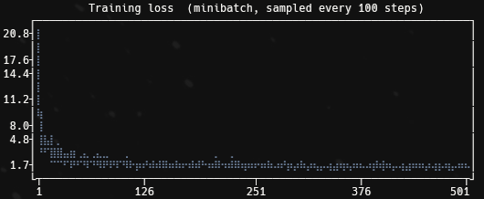
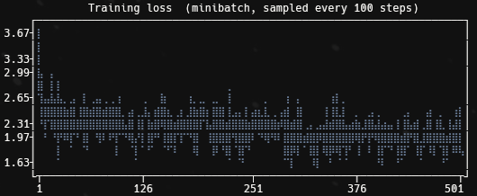
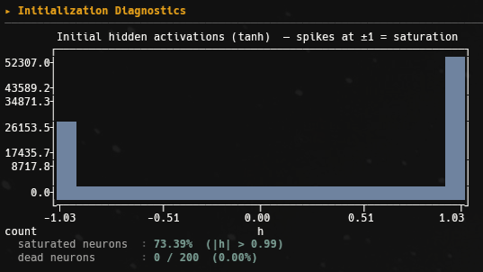
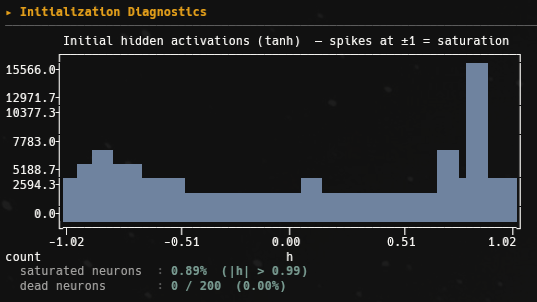

# 03 | Activations & BatchNorm

The **same** character-level MLP as `02-mlp` (embed → tanh hidden → logits), but
the focus shifts from architecture to the **health of the signal** inside the
network: how the activations and gradients behave at initialization and stay
behaved during training.

My `02` experiment ended on a warning sign, the loss started around `27`, far
above what a uniform guess should give, a symptom that the network began
*overconfident* because of a poor initialization. Here I take that on with three
measured fixes:

1. **Tame the output layer** so training starts at a sane loss instead of a spike.
2. **Scale the hidden layer** (Kaiming init) so `tanh` doesn't saturate.
3. **Add batch normalization** to keep the pre-activations well-conditioned all
   the way through training, not just at step 0.

Nothing about the model's *capacity* changes, same `20`-d embeddings, same `200`
hidden units, same 3-character context. Only the conditioning of the signal does.
And yet it moves the held-out loss.

## The starting point: a sick initialization

Two things go wrong at step 0 with naive `randn` weights, and we can *see* both.

- **The output is over-confident.** Random output weights produce large, random
  *logits*, so the softmax starts sharply peaked on arbitrary characters. The
  cross-entropy of a confident-and-wrong distribution is huge, many times the
  `ln(27) ≈ 3.30` nats of a uniform guess.
- **The hidden layer is saturated.** The pre-activations fed into `tanh` are too
  large, so most units sit pinned at `±1`, exactly where `tanh`'s slope is ~0 and
  almost no gradient flows back.

Each fix below targets one of these, and the script's *Initialization
Diagnostics* section measures it before training even starts.

## Fix 1: tame the output layer (kill the loss spike)

The first logits should be near zero, so the initial softmax is near-uniform and
the loss starts at the baseline. We get there by shrinking the output weights and
zeroing the output bias:

```python
W2 = torch.randn((n_hidden, vocab)) * 0.01   # tiny, not unit-scale
b2 = torch.randn(vocab) * 0                   # exactly zero
```

With logits ≈ 0, `softmax` ≈ uniform, and cross-entropy ≈ `ln(27)`. The run
confirms it, **initial loss `3.28` vs uniform baseline `3.30` nats**.

**Before** - naive init: the loss starts above `20` nats (the curve's y-axis tops
out at `20.8`) and collapses in a "hockey stick". Those first hundreds of steps
are wasted, the optimizer spends them just squashing the oversized output weights
back down, not learning anything about names.



**After** - output layer tamed: the loss starts right at the `~3.3` baseline and
goes straight into the useful `1.6–2.6` learning band. No spike, no wasted steps.



## Fix 2: keep `tanh` alive (Kaiming-scaled hidden layer)

The hidden pre-activation is `hpreact = emb @ W1`. With plain `randn` weights, the
variance of `hpreact` grows with the fan-in (here `3 × 20 = 60` inputs), so the
values are large and `tanh` clamps them to `±1`. A saturated unit has slope ~0,
it passes almost no gradient, so it barely learns. The cure is **Kaiming
(He) initialization**: scale the weights by `gain / sqrt(fan_in)`, with the
`tanh`-recommended `gain = 5/3`:

```python
W1 = torch.randn((block * n_embd, n_hidden)) * (5/3) / (block * n_embd) ** 0.5
```

That keeps `hpreact` at roughly unit variance, so `tanh` stays in its responsive
middle range. The activation histograms make the difference obvious.

**Before** - naive init: a deep `U`, almost every value piled against `±1`. The
diagnostic reports **`73.39%` of activations saturated** (`|h| > 0.99`). Most of
the hidden layer is contributing nearly nothing to the gradient.



**After** - Kaiming-scaled: the mass spreads across `(-1, 1)` and saturation drops
to **`0.89%`**. The layer is alive, every unit is in a regime where it can learn.



> **Saturated ≠ dead.** Both runs report `0 / 200` *dead* neurons. A neuron is
> "dead" only if it saturates for **every** example in the batch (a constant
> output, permanently gradient-starved). At init none are stuck like that, but a
> unit saturated on `73%` of examples still learns painfully slowly. The two
> metrics catch different failure modes, the histogram shows the everyday damage,
> the dead count catches the permanent kind.

## Fix 3: BatchNorm (keep it healthy *through* training)

Good initialization fixes step 0, but as the weights move, the pre-activations
can drift back toward saturation. **Batch normalization** enforces the healthy
distribution at every step instead of just hoping it survives: it normalizes the
hidden pre-activations to zero mean / unit std over the batch, then rescales them
with a learned gain and bias (`bngain`, `bnbias`) so the layer can still choose
its own scale.

```
hpreact  ->  (hpreact - batch_mean) / batch_std  ->  * bngain + bnbias  ->  tanh
```

**The train-vs-eval subtlety.** Normalizing over the batch is fine while
training, but at generation time we feed **one** context at a time, there is no
batch to compute a mean and std from. So during training we also keep a slow
running estimate of the mean and std (an exponential moving average,
`0.999 / 0.001`), and reuse those at eval/generation. A single example still gets
a sane, deterministic normalization, and the eval loss doesn't depend on who it
happened to be batched with. As a side effect, the batch-dependent noise during
training acts as a mild **regularizer**.

## Results

Same config as `02` (`n_embd = 20`, `n_hidden = 200`, 50k steps), the only
changes are the three fixes above. They show up directly on the held-out splits:

| split | `02-mlp` (same config) | `03` (init + batchnorm) |
| --- | --- | --- |
| train | 2.19 | **2.10** |
| val   | 2.26 | **2.13** |
| test  | 2.26 | **2.13** |

*(02 numbers from its tuning table at the matching `n_embd = 20` config.)*

Two things to read here:

- **The initial loss is fixed.** From `~27` nats in `02` down to **`3.28`**, right
  at the `ln(27) ≈ 3.30` uniform baseline. Training no longer wastes its first
  steps undoing a bad start.
- **Generalization improves by ~0.13 nats.** val/test drop from `2.26` to `2.13`.
  The gain isn't extra capacity (the model is identical), it's that healthy
  activations + batchnorm let the *same* parameters train better, plus a little
  regularization from the batch noise. val and test still move together, so the
  split stays trustworthy.

The samples read like plausible names:

```
brakina - jildane - roelanna - mariniya - elijane - ringatte - jalee - frion - kaani
```

## Running the experiment

From the repo root:

```bash
python3 src/03-activations-batchnorm/main.py
```

It loads the data, prints the **initialization diagnostics** (the activation
histogram and the saturated/dead counts), trains for 50k steps with a live
progress bar, then prints the held-out evaluation, a sampling trace, and a batch
of generated names.

## Takeaways

- **Initialization is not a detail.** A bad one wastes the early training (the
  loss spike) and can hobble whole layers (`tanh` saturation). Both are fixable in
  a few lines, and both are *measurable* before you train.
- **The uniform baseline `ln(vocab)`** is the sanity check for a fresh model's
  loss, if you start far above it, your init is making confident, wrong guesses.
- **Kaiming/He scaling** (`gain / sqrt(fan_in)`, `gain = 5/3` for `tanh`) keeps
  pre-activation variance under control so non-linearities stay in their useful
  range.
- **How to diagnose a layer**, the activation histogram plus the `% saturated`
  and `% dead` counts tell you whether the signal is healthy or stuck.
- **BatchNorm**, what it normalizes, why it keeps the network conditioned
  *throughout* training rather than only at init, and the running-stats trick that
  lets a single example be evaluated without a batch.
- A pointer to what's next: so far I've trusted `loss.backward()` to compute the
  gradients. In `04-manual-backprop` I open that box and derive them by hand, so
  the health of these gradients stops being something I infer from histograms and
  becomes something I can compute directly.
