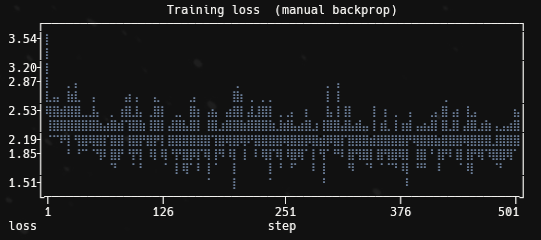

# 04 | Manual Backprop

The **same** model as `03-activations-batchnorm` (embed, BatchNorm, `tanh`
hidden, logits), but this time I delete `loss.backward()` and write the backward
pass myself, tensor by tensor. The point isn't a better score, it's to stop
treating autograd as a black box: derive every gradient by hand, then check each
one against PyTorch to prove the derivation is right.

This is the tensor-level sequel to a scalar autograd engine I built earlier (one
node per number, micrograd-style). The chain rule is identical, what's new is
that everything is now a tensor, so the difficulty moves off the calculus and
onto the **bookkeeping of shapes and broadcasting**: a quantity that broadcasts
in the forward pass has to be summed back down in the backward pass.

## The one invariant (and two rules)

Backprop on tensors is mostly two rules and one invariant I lean on everywhere.

- **The invariant: `d<x>` has the exact shape of `<x>`.** `dW2` is shaped like
  `W2`, `dlogits` like `logits`. It sounds trivial, but it's the single most
  useful check while deriving. If the shapes don't line up, the derivation is
  wrong, full stop.
- **Broadcast forward becomes sum backward.** Anywhere the forward pass stretched
  a small tensor over a big one (a bias added to a whole batch, the BatchNorm
  mean subtracted from every row), the backward pass sums the gradient back down
  over the axis that was broadcast.
- **Shapes pin the transposes.** For a matmul `D = A @ B`, the gradients are
  `dA = dD @ B.T` and `dB = A.T @ dD`. I never memorize which operand gets
  transposed, I just write the only arrangement whose shapes are valid.

## The model, written op by op

To differentiate the network I first have to *name* every intermediate value, so
the forward pass is deliberately spelled out one operation at a time instead of
in a few dense lines:

```
emb -> embcat -> hprebn -> BatchNorm -> hpreact -> h (tanh) -> logits -> cross_entropy
```

Each step writes its output into a `cache`, and the backward pass walks that
chain in reverse, turning the gradient with respect to one tensor into the
gradient with respect to the tensor just before it. Most of the steps are
mechanical:

| forward op | backward rule |
| --- | --- |
| `logits = h @ W2 + b2` | `dh = dlogits @ W2.T`, `dW2 = h.T @ dlogits`, `db2 = dlogits.sum(0)` |
| `h = tanh(hpreact)` | `dhpreact = (1 - h**2) * dh` |
| `embcat = emb.view(n, -1)` | reshape `dembcat` back to `emb`'s shape |
| `emb = C[Xb]` (indexing) | scatter-add (`dC.index_add_`), a char reused across contexts accumulates |

The `b2` row is the broadcast rule in action: `b2` was added to every row of the
batch, so its gradient is the sum of `dlogits` down the batch axis. The indexing
row is the only non-obvious one, a single character can appear in many contexts,
so its embedding gradient is the **sum** of the contributions from every place it
was used, which is exactly what a scatter-add does.

## Two gradients worth collapsing

Two steps are worth deriving as a single closed-form expression rather than
backpropagating through every micro-operation. The algebra cancels into something
both simpler and numerically cleaner.

**Cross-entropy.** Differentiating `softmax`, then `log`, then the negative
log-likelihood as separate steps is tedious, and the intermediates nearly cancel.
Done on paper the whole thing collapses to:

```python
dlogits = (softmax(logits) - onehot(Y)) / n
```

The gradient at the true class is `p - 1`, everywhere else it's just `p`,
averaged over the batch. One line, no intermediate tensors.

**BatchNorm.** Same story, worse algebra. Normalization couples every example in
the batch to the shared mean and variance, so a naive backward threads the
gradient through `bnraw`, `bnvar_inv`, `bnvar`, `bndiff` and the mean one tensor
at a time. Collapsed, it's a single expression:

```python
dhprebn = bngain * bnvar_inv / n * (
    n * dhpreact
    - dhpreact.sum(0)
    - n / (n - 1) * bnraw * (dhpreact * bnraw).sum(0)
)
```

The `n / (n - 1)` factor is there because the forward uses the unbiased,
Bessel-corrected variance, which is torch's default.

## Does it match autograd?

Deriving a gradient is one thing, trusting it is another. The script runs one
forward/backward pass and compares **every** manual gradient against the one
autograd computes for the same tensor, keeping `loss.backward()` around purely as
the reference:

```
  logits    | exact: False | approx: True  | shape ok: True  | maxdiff: 1.863e-09
  h         | exact: False | approx: True  | shape ok: True  | maxdiff: 1.863e-09
  W2        | exact: False | approx: True  | shape ok: True  | maxdiff: 2.235e-08
  b2        | exact: False | approx: True  | shape ok: True  | maxdiff: 7.451e-09
  hpreact   | exact: False | approx: True  | shape ok: True  | maxdiff: 1.863e-09
  bngain    | exact: False | approx: True  | shape ok: True  | maxdiff: 2.794e-09
  bnbias    | exact: False | approx: True  | shape ok: True  | maxdiff: 5.122e-09
  hprebn    | exact: False | approx: True  | shape ok: True  | maxdiff: 1.397e-09
  embcat    | exact: False | approx: True  | shape ok: True  | maxdiff: 3.725e-09
  W1        | exact: False | approx: True  | shape ok: True  | maxdiff: 1.490e-08
  emb       | exact: False | approx: True  | shape ok: True  | maxdiff: 3.725e-09
  C         | exact: False | approx: True  | shape ok: True  | maxdiff: 1.304e-08
```

Every gradient matches, with a max difference around `1e-9`.

**Why `approx: True` and not `exact: True`?** The two computations are
mathematically identical but not *bit*-identical. Floating-point addition isn't
associative, and my collapsed formulas sum things in a different order than
autograd's op-by-op graph, so the last few bits differ. A `1e-9` gap on values of
order 1 is float32 rounding noise, not a bug. Reproducing autograd's exact
operation order would make `exact` pass too, but that isn't the point. `approx`
(within a tiny tolerance) plus the shape check is the right bar.

> **One detail that keeps the check honest.** The biases (`b2`, `bngain`,
> `bnbias`) are initialized to small *random* values instead of the usual `0 / 1`.
> A zero bias can let a buggy backward accidentally land on the right number and
> pass the check for the wrong reason. Non-zero inits remove that loophole.

## Training on hand-made gradients

With the gradients trusted, the last stage throws autograd away entirely: the
training loop calls `manual_backward()` and updates each parameter straight from
the returned gradient, with no `loss.backward()` anywhere. Over 50k steps the
minibatch loss falls from an initial `3.54` to about `2.08` nats, the same regime
as `03`. That sameness is the whole point: hand-derived gradients train the
network exactly like autograd's, because they *are* autograd's, just written out
by hand.



The curve is the noisy minibatch loss sampled every 100 steps, the spread is
batch-to-batch noise, not instability.

## Sampling needs a calibrated BatchNorm

Generation feeds the model **one** context at a time, and that quietly breaks
BatchNorm. The forward pass normalizes using the batch's own mean and variance,
but the variance of a single example is undefined: the unbiased estimate divides
by `n - 1 = 0`, so a one-row batch produces `NaN` and the sampler has nothing to
draw from.

`03` dodged this with running statistics kept during training. This experiment's
forward has no such path, so instead I calibrate once after training: run the
whole train split through the network, freeze its population mean and variance,
and normalize with those fixed numbers at generation time. A single example then
gets a sane, deterministic normalization, and the samples read like plausible
names:

```
armiray - pierando - sammisa - lynn - kahtina - eshak - tyrialets - sadaiya - joanvit
```

## Running the experiment

From the repo root:

```bash
python3 src/04-manual-backprop/main.py
```

The **gradient check** always runs first: one forward/backward pass and the
`cmp()` table above, so you can watch every manual gradient line up with autograd.
The `TRAIN` flag controls what follows, with `TRAIN = True` the script then trains
for 50k steps (~25s on CPU) on the hand-derived gradients and prints the loss
curve, a sampling trace, and a batch of generated names. Set it to `False` to run
the check on its own.

## Takeaways

- **Backprop is the chain rule plus shape bookkeeping.** The calculus is the easy
  part, getting every tensor's shape and every broadcast-sum right is the actual
  work.
- **The shape invariant** (`d<x>` shaped like `<x>`) and the **broadcast becomes
  sum** rule catch most mistakes before you even run the check.
- **Some gradients collapse.** Cross-entropy and BatchNorm have clean closed forms
  that are simpler and steadier than backpropagating each micro-op.
- **`approx`, not `exact`.** Matching autograd to `1e-9` is success, bit-exactness
  isn't expected once you reorder floating-point additions.
- **A BatchNorm model can't be sampled on a single example** without population
  statistics, because batch statistics are undefined for one row.
- A pointer to what's next: now that the backward pass holds no mystery, in
  `05-wavenet` I pack these operations into small reusable layer modules and stack
  them into a deeper, tree-structured network, trusting autograd again but knowing
  exactly what it does underneath.
</content>
</invoke>
