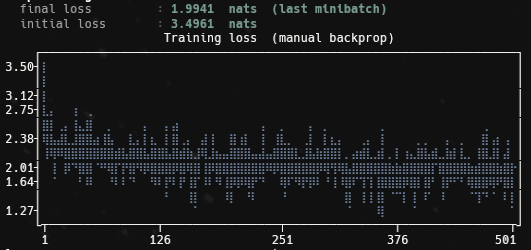

# 05 | WaveNet

Same dataset and task as every step before (predict the next character in a name),
but this one is two moves at once. First, I **refactor** the flat MLP into a
set of small reusable layer modules, the exact `__call__` + `parameters()` contract
of `torch.nn`. Second, I use those modules to grow the model from a flat MLP into a
**hierarchical, tree-structured network** inspired by WaveNet, one that fuses the
context a few characters at a time instead of swallowing it all in one layer.

The first half is really a software-architecture problem: by the end, defining a model
reads like the layer stacks you find in real codebases (`nn.Sequential`, modules
that expose a forward and their parameters). The second half is the conceptual
payoff: progressive fusion is, formally, a dilated causal convolution, and seeing
it built by hand demystifies the term.

## The module API

The whole refactor rests on one contract, copied straight from `torch.nn.Module`:
every layer is a small class with a forward (`__call__`) and a list of trainable
tensors (`parameters()`), nothing more.

```python
class Linear:
    def __init__(self, fan_in, fan_out, bias=True):
        self.weight = torch.randn((fan_in, fan_out)) / fan_in**0.5   # Kaiming init
        self.bias = torch.zeros(fan_out) if bias else None
    def __call__(self, x):
        self.out = x @ self.weight
        if self.bias is not None:
            self.out = self.out + self.bias
        return self.out
    def parameters(self):
        return [self.weight] + ([] if self.bias is None else [self.bias])
```

`Tanh`, `BatchNorm1d` (lifted from `03`), and `embedding` (the `C[X]` lookup wrapped
in a layer) all follow the same shape. A `Sequential` container then chains them and
flattens their parameters, the equivalent of `nn.Sequential`:

```python
class Sequential:
    def __init__(self, layers):
        self.layers = layers
    def __call__(self, x):
        for layer in self.layers:
            x = layer(x)
        return x
    def parameters(self):
        return [p for layer in self.layers for p in layer.parameters()]
```

The win is that a model is now a readable list of layers, and adding or reordering a
stage is a one-line edit instead of a rewrite of the forward pass.

## FlattenConsecutive: the shape gymnastics

The one genuinely new operation. It groups consecutive elements along the time axis
so the next layer can fuse them. Starting from `(B, T, C)` (batch, context length,
features), grouping by pairs gives `(B, T/2, C*2)`: each pair of neighbouring time
steps is concatenated into a vector twice as wide.

```python
class FlattenConsecutive:
    def __init__(self, n):
        self.n = n
    def __call__(self, x):
        B, T, C = x.shape
        x = x.view(B, T // self.n, C * self.n)   # regroup by n
        if x.shape[1] == 1:                      # only one group left -> flatten
            x = x.squeeze(1)
        self.out = x
        return x
    def parameters(self):
        return []
```

The `.view` is a free reinterpret-cast: it reorganizes how the same memory buffer is
read, no copy. The `squeeze(1)` drops the leftover size-1 dimension at the top of the
tree. As always, the bugs live in the shapes, so I tracked them at every stage.

## The hierarchical model

Here is the mistake I made first and the lesson it taught. My instinct was to stack
three `FlattenConsecutive(2)` back to back and then a single `Linear`. That runs and
trains fine, but it is **secretly the flat MLP**: three consecutive `view` calls with
no weights between them collapse into a single flatten of the whole context. Nothing
is fused progressively.

What actually builds the hierarchy is a `Linear -> BatchNorm1d -> Tanh` block
**between** each fusion. `FlattenConsecutive` only reshuffles memory, the `Linear` is
what learns to merge a pair into a new representation:

```python
model = Sequential([
    embedding(vocab_size, n_embd),
    FlattenConsecutive(2), Linear(n_embd*2,  n_hidden, bias=False), BatchNorm1d(n_hidden), Tanh(),
    FlattenConsecutive(2), Linear(n_hidden*2, n_hidden, bias=False), BatchNorm1d(n_hidden), Tanh(),
    FlattenConsecutive(2), Linear(n_hidden*2, n_hidden, bias=False), BatchNorm1d(n_hidden), Tanh(),
    Linear(n_hidden, vocab_size),
])
```

The rule to keep straight: each `FlattenConsecutive` doubles the feature dimension
(`C -> C*2`), and the `Linear` that follows brings it back to `n_hidden`. Taking the
context `. . j o r d a n` (two dots plus "jordan", which is exactly one 8-char
example predicting the final `.`), the shapes cascade like this:

```
embedding             . . j o r d a n  ->  (B, 8, 20)
FlattenConsecutive(2)                   ->  (B, 4, 40)    pairs of characters
  Linear(40 -> 200) + BN + Tanh         ->  (B, 4, 200)   learned bigram features
FlattenConsecutive(2)                   ->  (B, 2, 400)   pairs of pairs
  Linear(400 -> 200) + BN + Tanh        ->  (B, 2, 200)   learned 4-gram features
FlattenConsecutive(2)                   ->  (B, 1, 400) -> (B, 200)   the whole context
  Linear(400 -> 200) + BN + Tanh        ->  (B, 200)      one feature for all 8 chars
Linear(200 -> 27)                       ->  (B, 27)       logits
```

Which is the binary fusion tree at the heart of WaveNet:

```
.   .   j   o   r   d   a   n
└─┬─┘   └─┬─┘   └─┬─┘   └─┬─┘     stage 1: pairs of characters
  └───┬───┘       └───┬───┘       stage 2: pairs of pairs
      └───────┬───────┘           stage 3: the full context
              │
            logits
```

Each stage learns relations at a coarser scale: bigrams, then 4-grams, then the
whole window. And the grouping is fixed and non-overlapping, so `o` is only ever
paired with `j` at stage 1, never directly with `r`. That positional, range-doubling
structure is exactly what makes this a **dilated causal convolution**: I grew the
context to 8 characters precisely because the tree scales to longer contexts far
better than one wide layer that has to digest everything at once.

## The BatchNorm 3D bug

This was the trickiest bug to track down, in the spirit of `03`. My `BatchNorm1d`
from `03` only ever saw 2D tensors `(N, C)` and reduced over axis 0. The moment the
tensors become 3D `(B, T, C)`, that is wrong: reducing only axis 0 computes one set
of statistics per `(time, feature)` pair instead of per feature. I need to reduce the
batch axis **and** the group axis together:

```python
dim = (0, 1) if x.ndim == 3 else 0
mean = x.mean(dim, keepdim=True)
var  = x.var(dim, keepdim=True)
```

The lesson is the dangerous part: a silent shape change broke a layer without ever
raising an error. The model still ran, the loss still went down, it just computed the
wrong statistics. The only way to catch this is by inspecting shapes and internal
stats, the same diagnostic habit from `03`.

> **A subtle leftover.** With 3D input, `mean(dim=(0,1), keepdim=True)` has shape
> `(1, 1, C)` while the running buffers are `(1, C)`, so the running-stat update
> broadcasts them up to `(1, 1, C)`. It happens to stay correct here thanks to
> broadcasting, but it is the kind of silent shape drift worth flagging.

## Results

50k steps, `block_size = 8`, `n_embd = 20`, `n_hidden = 200`, about 175k parameters.
The minibatch loss falls from an initial `3.50` (right at the `ln(27) = 3.30` uniform
baseline, so the output init is sane) to about **`1.99`** nats.



For context, `03` and `04` sat in the `~2.10` regime at `block_size = 3`. The drop to
`~1.99` is real but modest, and most of it is bought by the **longer context** (3 to
8) rather than the hierarchy itself, the tree mainly earns its keep by scaling to that
longer context without one giant first layer.

> **An honest caveat on the number.** `1.99` is the last *minibatch* training loss, not
> a held-out figure, so it is noisy and slightly optimistic. The rigorous comparison,
> and the right next refinement, is a `@torch.no_grad()` pass over the dev split for
> both the flat MLP and this model at the same context length and parameter budget.

The samples read like plausible names:

```
haylah - eliyah - jovanna - kimber - darah - zelaya - makiyan - luzara - kalel - giana
```

## Running the experiment

From the repo root:

```bash
python3 src/05-wavenet/main.py
```

It loads the data, builds the hierarchical model from the module stack, prints the
dataset and model summary, trains for 50k steps with a live progress bar, then prints
the loss curve, a sampling trace for the first generated name, and a batch of
generated names.

## Takeaways

- **A layer is just `__call__` + `parameters()`.** Once every operation honours that
  contract, a model becomes a readable, reorderable list of modules, which is exactly
  how real `torch.nn` code is built.
- **Reshaping is not fusing.** Stacking `FlattenConsecutive` with nothing between the
  layers collapses back into a flat MLP. The `Linear` between each fusion is what
  actually learns to merge neighbours, and it is what makes the network hierarchical.
- **Follow the shapes.** `(B, T, C) -> (B, T/2, C*2)` at every stage, with the feature
  dimension doubling and the `Linear` bringing it back down. The shapes are the
  debugger.
- **Silent shape changes break layers quietly.** The BatchNorm bug raised no error and
  still trained, it just computed the wrong statistics. Inspecting shapes and internal
  stats is how you catch the failures that do not crash.
- **Hierarchical fusion is a dilated causal convolution.** Fixed, non-overlapping,
  range-doubling groups, the same structure under a name worth knowing.
- A pointer to what is next: now that layers are modules and the context is fused in a
  tree, in `06-gpt` I replace the fixed fusion tree with **self-attention**, where each
  position learns which other positions to look at instead of merging fixed neighbours.
</content>
</invoke>
