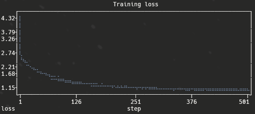
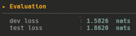
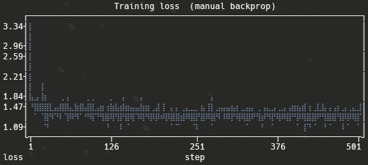
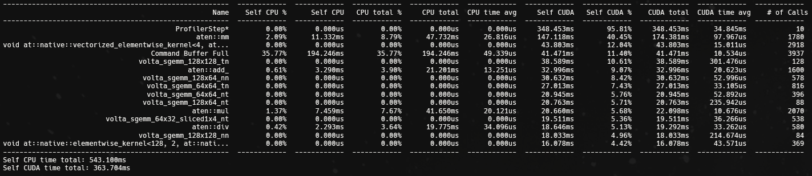
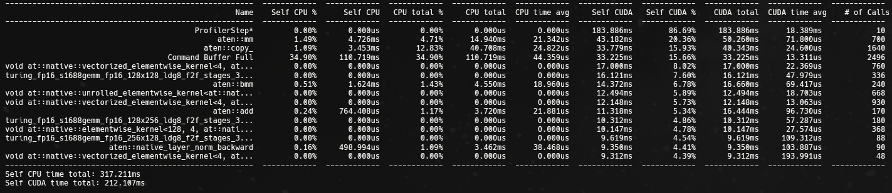

# 06 | GPT

`05` fused the context with a fixed tree: every character was merged with its fixed
neighbour, stage after stage, in an order decided in advance. This step throws that
fixed wiring away. Each position now learns, on its own, **which other positions to
read from**, by content rather than by location. That mechanism is self-attention,
and stacking it into residual blocks with positional information is a decoder-only
Transformer, the architecture under GPT.

Same task as every step before (predict the next character), but built from scratch:
token and positional embeddings, masked self-attention, residual pre-norm blocks, all
honouring the same `__call__` + `parameters()` layer contract from `05`. I run it on
two corpora behind a toggle: the familiar names list, and a ~1.1 MB slice of
Shakespeare.

## Self-attention: a content-based lookup

The heart of the model is one `Head`. Every position emits three vectors: a **query**
(what I am looking for), a **key** (what I offer), and a **value** (what I will hand
over if picked). A position decides how much to read from every other position by
comparing its query against their keys, then it collects a weighted sum of their
values.

```python
class Head:
    def __call__(self, x):                                    # x: (B, T, n_embd)
        k, q, v = self.key(x), self.query(x), self.value(x)   # each (B, T, head_size)
        wei = q @ k.transpose(-2, -1) * k.shape[-1] ** -0.5   # (B, T, T) affinities
        wei = wei.masked_fill(self.tril[:T, :T] == 0, float("-inf"))
        wei = F.softmax(wei, dim=-1)
        return wei @ v                                        # (B, T, head_size)
```

The `q @ k.T` product is a `(T, T)` table of affinities: row `i`, column `j` is how
strongly position `i` wants to read position `j`. Softmax turns each row into weights
that sum to one, and `wei @ v` is the weighted average of values the position takes
away.

The `* head_size ** -0.5` factor matters more than it looks. Without it the dot
products grow with `head_size`, softmax saturates onto a single entry, and attention
collapses into a hard pick that barely trains. Scaling by `1/sqrt(head_size)` keeps
the affinities near unit variance so softmax stays soft.

## Causal masking: no reading the future

A model that predicts the next character must never look at it. The mask is the one
line that enforces this: before softmax, every affinity where `j > i` is set to
`-inf`, so after softmax it is exactly zero. Position `i` attends to itself and
everything before it, nothing after.

```
       can position i (row) read position j (col)?
          j=0  j=1  j=2  j=3
   i=0    yes    .    .    .
   i=1    yes  yes    .    .
   i=2    yes  yes  yes    .
   i=3    yes  yes  yes  yes
```

`self.tril` is a lower-triangular matrix of ones held as a plain buffer (not a
trainable parameter), sliced to the current length `[:T, :T]`. This is the single
difference between an encoder block, which sees everything, and the decoder block GPT
needs.

## Many heads, then recombine

One head learns one kind of relationship. Several heads, each with its own Q/K/V,
learn different ones in parallel, then their outputs are concatenated and projected
back to the embedding width.

```python
class MultiHeadAttention:
    def __call__(self, x):
        out = torch.cat([h(x) for h in self.heads], dim=-1)   # (B, T, num_heads*head_size)
        return self.proj(out)                                  # (B, T, n_embd)
```

With `n_embd = 256` and `4` heads, each head works in a `64`-dimensional subspace, and
the concatenation reassembles the full `256` width. Splitting the budget across heads
costs nothing in parameters and lets the layer track several patterns at once.

## The block: communicate, then think

A Transformer block does two things in turn. Attention lets positions **communicate**,
gathering information from each other. A small per-position feedforward then lets each
position **think** on what it gathered. Both are wrapped the same way: normalize
first, run the sublayer, add the result back as a residual.

```python
def __call__(self, x):
    x = x + self.sa(self.ln1(x))     # communication: pre-norm + residual
    x = x + self.ffwd(self.ln2(x))   # computation:   pre-norm + residual
    return x
```

The residual `x + ...` is what lets four blocks stack without the gradient dying: each
sublayer only has to learn a correction to its input, and there is always a clean path
for the gradient to flow straight through. Normalizing *before* each sublayer
(pre-norm) rather than after is the arrangement that trains stably at depth. The
feedforward itself is the familiar stack from `05`, a `Linear` up to `4 * n_embd`, a
`ReLU`, and a `Linear` back down.

## Position has to be told

Attention has no built-in sense of order: permute the input positions and the
affinities permute with them, the result is identical. Yet "abc" and "cab" are not the
same string. So position is added explicitly. Alongside the token embedding (what the
character is) sits a position embedding (where it sits), and the two are summed before
the blocks.

```python
tok_emb = self.token_embedding_table(idx)                 # (B, T, C)  what
pos_emb = self.position_embedding_table(torch.arange(T))  # (T, C)     where
x = tok_emb + pos_emb
x = self.blocks(x)        # stack of attention / feedforward blocks
x = self.ln_f(x)          # a final LayerNorm
logits = self.lm_head(x)  # (B, T, vocab_size)
```

## One target became T targets

The shape change from the earlier chapters is the thing that took me longest. In the
MLP and WaveNet steps, each window predicted **one** next character: `X` was
`(N, block_size)`, `Y` was `(N,)`. A Transformer predicts at **every** position at
once thanks to the causal mask, so a `(B, T)` input yields `(B, T, vocab)` logits, `T`
predictions per sequence.

That means the target has to be the input shifted by one position: `Y[t]` is the token
that follows `X[t]`, for every `t`. The first time I fed the old single-target `Y` into
`cross_entropy` I got a clean shape mismatch (`256` predictions against `32` targets),
which is exactly the symptom of `T` predictions meeting one target. Building `Y` as the
shifted window fixed it, and it is the same idea whether the data is a list of names or
one long stream.

> The lesson is the one the whole project keeps teaching: the bugs live in the shapes.
> A `(B, T, vocab)` output is the model saying it predicts everywhere, and the data has
> to answer everywhere.

## Running it on the GPU

This is the first step heavy enough to want a GPU, and the from-scratch design made
that interesting. The model is not an `nn.Module`, so there is no `.to(device)` for
free. I wrote one on every layer, each moving its own tensors and delegating to its
children. Two details bit:

- The hand-rolled tensors (a `Linear`'s `weight`, a `LayerNorm`'s `gamma`) have to be
  relocated through `.data`, not reassigned. `self.weight = self.weight.to(device)`
  turns a leaf tensor into a non-leaf one and gradients stop arriving;
  `self.weight.data = self.weight.data.to(device)` keeps it a trainable leaf.
- The `tril` mask is a buffer, not a parameter, so a generic walk over `parameters()`
  never sees it. Left on the CPU while everything else moved, it raised a
  device-mismatch at the mask step. Each head moves its own `tril` by hand.

With both handled, the same code runs on CPU or CUDA from a single `DEVICE` switch.

## Two corpora, one toggle

A `DATASET` flag chooses the data, and only the loader changes, the model does not:

- **names**: a list of short words, each padded to `block_size` and ended with `.`
  (token 0), exactly as before.
- **shakespeare**: one continuous character stream. The whole text is encoded once,
  split 80/10/10, and sliced into overlapping `(window, shifted-window)` pairs. There
  is no padding and no end token, so generation simply runs for a fixed number of
  characters.

The `05` writeup flagged that the final *minibatch* loss is optimistic and that the
real measure is a held-out pass. I added exactly that here: an `evaluate_loss` that
averages cross-entropy over the dev and test splits for either corpus, so every run
reports an honest number, not just the noisy training one.

## Results

**Shakespeare.** `n_embd = 256`, `block_size = 32`, `4` heads, `4` layers, about
`3.45M` parameters, 50k steps (~27 min on a 2080 Ti). The minibatch loss falls from
`4.32` (just above the `ln(65) = 4.17` uniform baseline, so the init is sane) to
`1.17`.



The held-out splits land higher than the optimistic minibatch number, which is the
whole reason to measure them:



The samples have learned the *shape* of a play, speaker names in caps, line breaks,
punctuation, even when the meaning wanders:

```
DUCHESS:
Speak no tongue makes for a little fighton's
With eager men are his voice?

KING RICHARD II:
Thou art the water and gentlewoman.
See, lords, Camillo.
```

**Names.** The same architecture, much smaller (`n_embd = 20`, `block_size = 8`, about
`42k` parameters), kept as a sanity baseline. The minibatch loss drops from `3.34`
(right at the `ln(27) = 3.30` uniform baseline) to about `1.65`.



The samples read like plausible names:

```
cawrell - roner - jatace - jayla - kam - meline - raylee - anely - saylee - azide
```

> A caveat I keep in mind for the names number. With `block_size` larger than a typical
> name, most positions in a window are padding predicting padding, which is trivial and
> pulls the average loss down. The Shakespeare stream has no padding, so its loss is the
> more honest one to trust.

## Profiling: why the hand-rolled version was slow

Everything up to here was written by hand on purpose. From `01` onward the goal was to
*see* the mechanics. A `Linear` is a matmul plus a bias, an optimizer step is
`p -= lr * p.grad`, a LayerNorm is a mean, a variance and a rescale, and every layer
spells the math out operation by operation. That is the right call for learning and a
poor one for speed, and the ~27-minute Shakespeare run was a good excuse to find out
*why*, with a real profiler instead of guesswork.

`torch.profiler` records both CPU and CUDA time per operation. The first pass said the
training was already **GPU-bound** (the CPU spent most of its time blocked on a full
command queue, waiting on the GPU), and that the GPU time split in two: a healthy core
of matrix multiplies, and a long tail of *many tiny kernels*. That tail is exactly
where hand-rolled code pays for its clarity.



Three things stood out, and each maps to something PyTorch's built-ins do that the
naive version does not.

**Too many small matmuls: batch the heads.** `MultiHeadAttention` was a Python list of
`Head` objects, each running its own little `(n_embd → head_size)` projections. Across
4 heads and 4 layers that is dozens of tiny matmuls every step; the profiler counted
~178 `aten::mm` calls. A GPU is happiest with a few *large* matmuls: every
kernel launch has fixed overhead, and a tiny GEMM leaves most of the cores idle. The
fix is the standard one: do **one** big projection for all heads at once, then
`view`/`transpose` the result into `(B, n_head, T, head_size)` and let a single batched
matmul handle every head together. That took `aten::mm` from ~178 to ~70 calls per
step. PyTorch's own `nn.MultiheadAttention` batches the heads this way internally; the
list-of-heads form is the readable one, not the fast one.

**A Python loop over parameters: vectorize the optimizer.** The optimizer stepped each
tensor in a Python `for` loop: `p.data -= lr * p.grad`, once per parameter, ~160 times
a step, each a separate kernel launch. `torch._foreach_add_` (and `_foreach_zero_` for
the gradients) takes a whole *list* of tensors and applies the update in one fused
multi-tensor kernel: the same arithmetic in a fraction of the launches. This is exactly what
`torch.optim`'s optimizers do under the hood (their `foreach`/`fused` paths); the hand
loop is the version that makes the update obvious.

**LayerNorm as five ops: fuse it.** The hand-written `LayerNorm` computed the mean, the
variance, the normalization, the scale and the shift as separate tensor operations.
Each is its own CUDA kernel that reads the whole tensor from memory and writes it back;
these ops are memory-bandwidth bound, so five passes cost roughly five times the
traffic, plus five launches, every call, forward *and* backward. `F.layer_norm` does
the lot in a **single fused kernel**, one pass over the data. Swapping it in collapsed
the elementwise tail: over ten steps, divisions fell from ~580 to ~40, multiplies from
~770 to ~140, and the separate `mean`/`var` ops vanished. (As a bonus, `F.layer_norm`
uses the biased variance the canonical LayerNorm expects, where my hand version used
the unbiased estimator.)

On top of those I turned on **mixed precision** (autocast) so the matmuls run on the
2080 Ti's fp16 tensor cores. The catch the profiler made concrete: this only helps once
the model is large enough to be compute-bound. On the tiny names model fp16 was
measurably *slower* (the cost of casting fp32↔fp16 outweighed the tensor-core gain),
so AMP sits behind a flag, off by default.



Together these took the step from roughly **32 ms to about 19 ms** on the same
hardware, with no change to what the model computes.

The honest summary: none of this made the math better, it made the *same* math hit the
hardware better. The hand-rolled layers were never "unoptimized" by accident; they
were written to be read, one operation at a time, and one operation at a time is one
kernel at a time. PyTorch is faster because its library functions do three things the
naive code does not: **fuse** many operations into one kernel (LayerNorm), **batch**
many tensors into one launch (the optimizer, the heads), and reach **hardware
features** like tensor cores (AMP). Writing the slow version first is what made it
clear what those built-ins are actually buying.

## Running the experiment

From the repo root:

```bash
python3 src/06-gpt/main.py
```

Pick the corpus with the `DATASET` flag at the top of the file (`"names"` or
`"shakespeare"`). The script prints the dataset and model summary, trains for 50k steps
with a live progress bar and loss curve, reports dev and test loss, then samples from
the model: a batch of names, or a passage of generated text. The Shakespeare corpus is
gitignored; `data/README.md` has the one-line command to fetch it.

## Takeaways

- **Attention is a learned, content-based lookup.** Query against keys, softmax into
  weights, average the values. The `(T, T)` affinity table is the whole idea,
  everything else is wrapping.
- **The mask is what makes it a decoder.** One `-inf` triangle before softmax stops a
  position from reading its own future, the single change that turns generic attention
  into a next-token model.
- **Residual pre-norm blocks are what let it stack.** Each sublayer learns a
  correction, the residual keeps a clean gradient path, and normalizing first keeps it
  stable at depth.
- **Attention is order-blind, so position is a separate input.** A token embedding for
  what, a position embedding for where, summed.
- **The output predicts everywhere, so the data must too.** `(B, T, vocab)` logits need
  a target shifted by one at every position, not a single next character.
- **A from-scratch model needs its own `.to(device)`.** Move tensors through `.data` to
  keep them trainable leaves, and do not forget buffers like the mask.
- **Hand-rolled is clear, not fast, and the gap is the lesson.** Profiling put the
  cost in many tiny kernels: per-head matmuls, a per-parameter optimizer loop, a
  five-op LayerNorm. Batching the heads, `torch._foreach_` in the optimizer and a fused
  `F.layer_norm` cut the step from ~32 to ~19 ms. PyTorch is faster because it fuses,
  batches and reaches tensor cores; the naive version runs one kernel per operation.
- A pointer to what is next: the model still reads one character at a time, which makes
  sequences long and the vocabulary tiny. In `07-tokenizer` I replace the character
  vocabulary with a learned subword one (byte-pair encoding), trading a bigger
  vocabulary for much shorter sequences.
